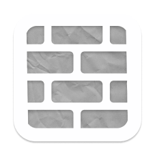
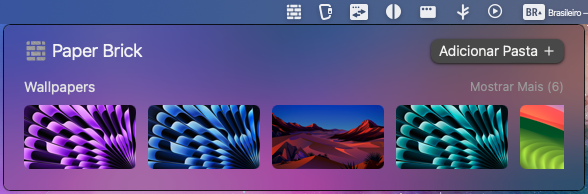
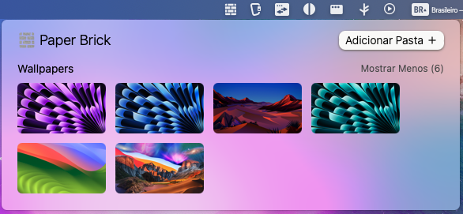

#  Paper Brick

A macOS app that helps users change their desktop wallpaper quickly.

**Paper Brick** is a small project and its only purpose is to be a faster way to change wallpapers since going to settings was too slow for me. Because of that, I decided to create it as a **System Tray** app

  
  

With the app, you can:

- Chose a directory so that the app can scan all its image files;
- See thumbnails from all the scanned images;
- Select the new wallpaper by clicking an image.

### Technologies

This was a simple project. It helped me learn more about SolidJS, and discover new desktop solutions outside of Electron. For this project, I used:

- [Solid JS](https://www.solidjs.com/) for the UI;
- [Solid Icons](https://solid-icons.vercel.app/) for the icons;
- [Tailwind CSS](https://tailwindcss.com/) for styling;
- [i18n](https://www.i18next.com/) for internationalization.
